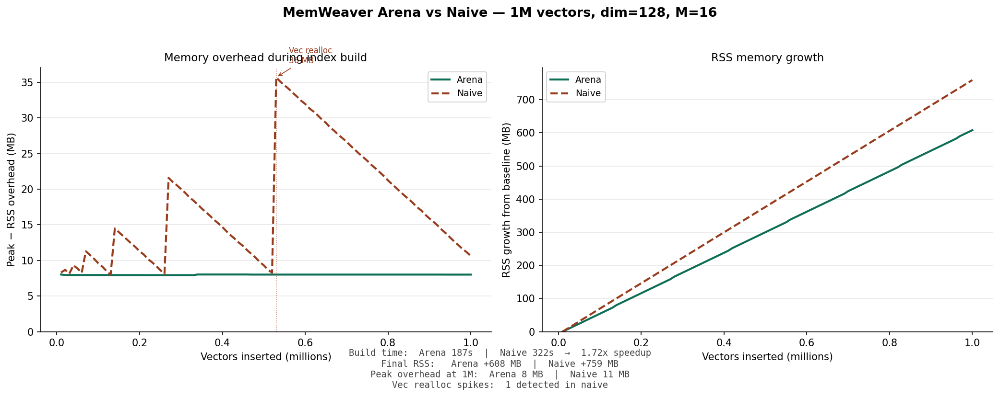

# MemWeaver

A temporal vector database with predictable memory usage. Memory cost is a function of vectors, dimensions, and M — known before deployment, not discovered in production.

```
memory ≈ n × node_size
```

For dim=128, M=16: `node_size = 640 bytes`, so 1M vectors requires approximately **640 MB** — calculable before any data is inserted.

---

## Why MemWeaver

Most vector databases have two operational problems:

**Memory is unpredictable.** You cannot know your memory cost before you deploy. You provision generously, monitor closely, and scale reactively.

**Search is temporally blind.** A document from last week and a document from three years ago are treated identically. Recency is either ignored or handled by timestamp filters that don't affect ranking.

MemWeaver is designed around two opposite principles:

- **Memory is a first-class design constraint**, not a runtime surprise.
- **Time is a first-class dimension of relevance**, not a filter applied after the fact.

---

## Radar — Built on MemWeaver

Radar is a semantic knowledge search system built on MemWeaver, indexing articles from RSS feeds and Common Crawl with temporal relevance.

Search query: `"startup funding"`


Recent articles surface naturally ahead of older ones. No explicit timestamp filtering — temporal relevance is structural, not bolted on.

### Radar Pipeline

```
RSS feeds / Common Crawl CDX
        ↓
  FetchArticlesFromRSS / FetchArticlesForDomain
        ↓
  EmbedBatch (embed-svc — sentence-transformers)
        ↓
  StoreText → Postgres (metadata) + local disk (article bodies)
        ↓
  BatchInsertMemWeaver (HNSW vector index)
        ↓
  Search API → UI
```

Each stage is an independent Temporal activity — crash-safe, retriable, observable. Text storage is outside MemWeaver; the search API returns `vector_id` values resolved against Postgres metadata.

---

## Benchmarks

Evaluated on SIFT1M (1M vectors, dim=128) using two hardware configurations:
- **AWS m5d.4xlarge** (Intel Xeon, AVX-512, 16 vCPUs, 64 GB RAM) — arena vs naive comparison
- **Apple M-series, 6 performance cores** — parallel insertion and TimeBucket benchmarks

**Configuration:** M=16, M_MAX0=32, ef_construction=40, ef_search=100, k=10. Compiled with `target-cpu=native`.

### Arena vs naive implementation

| Implementation | Build time | Search (50 queries) | Speedup |
|---|---|---|---|
| Arena (MemWeaver) | 187s | 20.4ms | — |
| Naive (Vec-based) | 322s | 34.9ms | 1.72x slower |

Arena allocation is **1.72x faster** to build and **1.71x faster** to query. Collocating each vector with its HNSW edges means graph traversal loads vector and edges in one cache access instead of two.

### Memory predictability

The arena implementation maintains a **constant ~8 MB peak overhead** throughout 1M vector insertion. The naive Vec-based implementation shows reallocation spikes of 21.6 MB at 270k vectors and 35.7 MB at 530k vectors.

The arena implementation also uses **25% less total RSS** at 1M vectors (608 MB growth vs 759 MB).



### Parallel insertion (Apple M-series, 6 performance cores)

M=16, M_MAX0=32, ef_search=100, k=10, 10,000 queries.

| Config | Build (1 thread) | Build (6 threads) | Speedup | Mean recall@10 | Min recall |
|--------|-----------------|-------------------|---------|----------------|------------|
| Naive (Vec-based) | 195s | — | — | 0.965 | 0.300 |
| ef_construction=40 | 124s | 70s | 1.77x | 0.965 | 0.300 |
| ef_construction=100 | 253s | 112s | 2.26x | 0.961 | 0.000 |
| ef_construction=100 + capacity-aware | 273s | **103s** | **2.65x** | **0.979** | **0.400** |
| TimeBucket n=8 | 84s | — | 1.48x | 0.940 | 0.40 |
| TimeBucket n=16 | 62s | — | 2.0x | 0.949 | 0.40 |

**Throughput:** single thread 7,420 vec/s → two-phase 4 threads 12,624 vec/s, **1.70x speedup**.

**Recommended production configuration:** ef_construction=100 + capacity-aware + 6 threads — 103s build (faster than ef=40 single-thread at 124s), mean recall 0.979 (better than ef=40 at 0.965), no zero-recall queries.

**Why ef_construction=100 standard degrades quality:** more candidates triggers aggressive diversity pruning, creating eviction cascades that isolate sparse-region nodes (13 zero-recall queries). Capacity-aware neighbor selection penalizes high-degree nodes, preventing cascades.

**Why higher ef_construction gives better parallel speedup:** more work per insertion means a larger parallel fraction and smaller sequential fraction (Amdahl's law). ef=40: 1.77x speedup; ef=100: 2.65x speedup.

### Search performance (Apple M-series, 6 performance cores)

SIFT1M, k=10, 10,000 queries, ef_construction=100 + capacity-aware.

#### MemWeaver scaling

| ef_search | Threads | QPS | p50 | p99 | Recall@10 | Min recall |
|-----------|---------|-----|-----|-----|-----------|------------|
| 100 | 1 | 2,908 | 0.332ms | 0.871ms | 0.979 | 0.400 |
| 100 | 6 | 17,021 | 0.351ms | 0.512ms | 0.979 | 0.400 |
| 200 | 1 | 1,761 | 0.572ms | 0.800ms | 0.994 | 0.600 |
| 200 | 6 | 9,916 | 0.588ms | 0.813ms | 0.994 | 0.600 |

Search scales near-linearly — 97% efficiency at 6 threads for ef=100, 5.6x at ef=200.

#### MemWeaver vs Qdrant (same hardware, same dataset)

Both run on Apple M-series, SIFT1M, M=16, ef_construction=100, k=10.

| System | ef_search | QPS (6t) | p50 | p99 | Recall@10 | Min recall |
|--------|-----------|----------|-----|-----|-----------|------------|
| MemWeaver | 100 | 17,021 | 0.351ms | 0.512ms | 0.979 | 0.400 |
| **MemWeaver** | **200** | **9,916** | **0.588ms** | **0.813ms** | **0.994** | **0.600** |
| Qdrant | 100 | 6,179 | 0.946ms | 1.512ms | 0.995 | 0.500 |

At equivalent recall (0.994 vs 0.995), MemWeaver is **1.6x higher throughput** and **1.6x lower latency** than Qdrant. MemWeaver min recall (0.600) is also better than Qdrant (0.500) at this operating point.

Qdrant builds **7x faster** (14s vs 103s) using internal quantization. MemWeaver uses full float32 throughout; quantization is on the roadmap and expected to close the build time gap while maintaining the search throughput advantage.

Qdrant's QPS plateaus after 4 concurrent tasks due to server overhead. MemWeaver is an embedded library — parallel search scales directly with thread count with no server layer.

Two-phase parallel insertion separates the read-heavy neighbor search phase (parallelized across threads) from the write-heavy edge update phase (applied sequentially). Upper-level beam search (ef=5 at layers 1+) replaces greedy descent, escaping local optima. See [`docs/parallel_insertion.md`](docs/parallel_insertion.md) for the full design.

The min=0.300 across all configurations reflects two hard queries in sparse regions of SIFT1M — a fundamental HNSW characteristic at M=16, ef_search=100, not an implementation issue.

---

## Temporal Architecture

MemWeaver partitions vectors into time buckets. Recent vectors live in hot buckets (in-memory HNSW). Older vectors are demoted to cold buckets (disk or S3).

```
Hot buckets (RAM):    recent vectors, fast HNSW search
Cold buckets (disk):  older vectors, on-demand search
S3 cold tier:         archived buckets, restored on demand
```

Search spans all buckets. Results are merged and re-ranked with recency weighting — vectors in recent buckets score higher for equivalent semantic distance.

### Hot/Cold Tiering

```rust
// Demote a bucket to disk
index.swap_out(bucket_seq).await?;

// Restore from disk for search
index.swap_in(bucket_seq).await?;

// Recall is identical after swap cycle — bit-perfect restore validated
```

Bit-perfect restore is validated: recall is identical before and after a hot→cold→hot cycle.

### Blob Storage Cold Tier

Cold buckets can be archived to S3 (or GCS, Azure Blob via `object_store`). On search, cold buckets are temporarily read from object storage without full restoration.

```
s3://your-bucket/{BLOB_PREFIX}/
├── catalog.json                    ← live collection registry
└── {collection}/
    ├── collection.json             ← index config + WAL high-water mark
    ├── wal/
    │   └── 00000000000000000001.wal  ← binary WAL entry (insert batch)
    └── seq_{n}/
        ├── bucket_meta.json        ← commit pointer → snap_{T}/
        └── snap_{T}/
            ├── block_0.arena       ← arena bytes + CRC32
            ├── levels.bin          ← node IDs and level assignments
            └── manifest.json       ← HNSW entry point and max layer
```

See `docs/snapshot-format.md` and `docs/crash-recovery.md` for the full format specification.

---

## Horizontal Scaling

MemWeaver scales along two dimensions:

**Collection sharding (write scaling):**

Large collections are partitioned across nodes. Each node owns a subset of time buckets. Consistent hashing routes inserts to the correct shard. Search results are merged and re-ranked at query time across shards.

**Stateless reader nodes (read scaling):**

Cold buckets are served from S3 by any reader node — no local state required. S3 is the source of truth. Adding reader nodes scales search throughput linearly. Hot buckets are replicated to reader nodes on demand.

```
                    ┌─────────────┐
                    │  Search API │
                    └──────┬──────┘
                           │
              ┌────────────┼────────────┐
              ▼            ▼            ▼
        ┌──────────┐ ┌──────────┐ ┌──────────┐
        │ Reader 0 │ │ Reader 1 │ │ Reader N │  ← stateless, S3-backed
        └──────────┘ └──────────┘ └──────────┘
              │            │            │
              └────────────┼────────────┘
                           ▼
                    ┌─────────────┐
                    │     S3      │  ← source of truth for cold tier
                    └─────────────┘
```

This is currently in progress — see [Current Status](#current-status).

### Server configuration

| Variable | Default | Description |
|---|---|---|
| `LISTEN_ADDR` | `0.0.0.0:50051` | gRPC listen address |
| `DATA_DIR` | `./data` | Local directory for on-disk bucket files |
| `BLOB_BUCKET` | — | Blob storage bucket (S3/GCS/Azure); required for WAL and snapshots |
| `BLOB_REGION` | `us-east-1` | Storage region |
| `BLOB_PREFIX` | `mem-weaver` | Key prefix inside the bucket |
| `WAL_UPLOAD_INTERVAL_MS` | `200` | How often the WAL uploader flushes to blob storage |
| `SNAPSHOT_INTERVAL_SECS` | — | How often arena snapshots are taken; unset disables snapshots |
| `SNAPSHOT_MIN_DIRTY_VECTORS` | `0` | Minimum new vectors per collection before a snapshot fires; `0` = always snapshot dirty buckets. WAL replay is cheap for small counts — a value around `10000` avoids frequent small uploads while still bounding recovery time |

---

## gRPC API

```protobuf
service MemWeaver {
  rpc BatchInsert(BatchInsertRequest) returns (BatchInsertResponse);
  rpc Search(SearchRequest) returns (SearchResponse);
  rpc CreateCollection(CreateCollectionRequest) returns (CreateCollectionResponse);
}

message InsertItem {
  repeated float vector    = 1;
  uint64         timestamp = 2;  // unix seconds
  uint64         vector_id = 3;  // caller-assigned
}

message SearchRequest {
  repeated float  query            = 1;
  uint32          k                = 2;
  uint32          ef               = 3;
  optional uint64 time_range_start = 4;  // optional temporal filter
  optional uint64 time_range_end   = 5;
}

message SearchHit {
  uint64 vector_id = 1;  // caller resolves to text via their own store
  float  distance  = 2;
}
```

MemWeaver returns `vector_id` values. Text storage is the caller's responsibility — use Postgres, SQLite, Cassandra, or S3 depending on your scale. This keeps MemWeaver focused and composable with infrastructure you already run.

---

## Arena Design

### Collocated node layout

MemWeaver stores each vector adjacent to its HNSW edges in a single arena block:

```
[ vector_1 | edges_1 | vector_2 | edges_2 | ... | vector_n | edges_n ]
```

Cache locality during graph traversal: accessing a node's vector and its edges is a single cache line read.

### NodeId encoding

```
NodeId (u32): [ block_index: 14 bits | offset >> 3: 18 bits ]
```

- Arena size: 2MB. 8-byte alignment saves 3 bits.
- Result: 14 bits block index + 18 bits offset → **32 GB addressable**.
- Node lookup: two pointer hops (block array + offset arithmetic).

### Alignment

For typical configurations, node sizes are naturally cache-line aligned:

```
dim=128, M=16:
  node_size = 512 (vector) + 128 (edges) = 640 bytes = 64 × 10 ✓
```

### max_layer storage

`max_level` per node is stored in `levels.bin` alongside `vector_id`, not collocated in the arena. It is not on the critical path during HNSW traversal. This keeps node size a clean multiple of 64 bytes and enables efficient cold storage.

### Predictable memory formula

```
memory ≈ n × node_size

node_size = dim × 4  +  M_MAX0 × 4  +  higher_layer_nodes × M × 4
```

For dim=128, M=16, M_MAX0=32:

```
node_size ≈ 640 bytes
1M vectors ≈ 640 MB
10M vectors ≈ 6.4 GB
100M vectors ≈ 64 GB
```

Known before deployment. Not discovered in production.

---

## Running the Benchmarks

```bash
# Download SIFT1M dataset
wget ftp://ftp.irisa.fr/local/texmex/corpus/sift.tar.gz
tar -xzf sift.tar.gz

export SIFT1M_BASE_PATH=/path/to/sift

# Run benchmarks
RUSTFLAGS="-C target-cpu=native" cargo test --release

# Arena only
SIFT1M_HNSW_BENCH_VARIANT=arena SIFT1M_HNSW_BENCH_SAMPLE_SIZE=1 \
  cargo bench -p index --bench hnsw_sift1m 2> arena.txt

# Naive only
SIFT1M_HNSW_BENCH_VARIANT=naive SIFT1M_HNSW_BENCH_SAMPLE_SIZE=1 \
  cargo bench -p index --bench hnsw_sift1m 2> naive.txt

# Generate memory comparison chart
python3 scripts/plot_memory.py arena.txt naive.txt
```

---

## Current Status

**Core index:**
- [x] HNSW index with arena allocator
- [x] Collocated node layout (vector + edges)
- [x] NodeId encoding for O(1) node lookup
- [x] SIMD distance computation (AVX2/AVX-512 via `wide` crate)
- [x] Benchmarked on SIFT1M

**Temporal relevance:**
- [x] Time-bucketed multi-HNSW
- [x] Configurable aging policy
- [x] Recency-weighted search with pluggable distance adjustment

**Hot/cold tiering:**
- [x] Explicit hot/cold tiering — swap_out / swap_in
- [x] Bit-perfect restore — identical recall after swap cycle
- [x] Cold bucket search via temporary file read
- [x] S3/GCS/Azure cold tier via `object_store`

**Persistence and crash recovery** ([format](docs/snapshot-format.md) · [recovery](docs/crash-recovery.md) · [tests](docs/crash-recovery-tests.md)):
- [x] Metadata storage (levels.bin, manifest.json)
- [x] Periodic arena snapshots to blob storage (versioned staging, CRC32)
- [x] Write-Ahead Log — inserts acked only after WAL entry confirmed in blob storage
- [x] Crash recovery — restores from snapshot then replays WAL; cross-bucket consistent
- [x] Catalog-driven recovery — only live collections restored, stale snapshots ignored
- [x] Idempotent inserts — duplicate `vector_id` silently skipped; `BatchInsertResponse` lists accepted vectors only
- [x] Dirty-block tracking — only modified arena blocks are re-uploaded; cold buckets skipped entirely

**API:**
- [x] gRPC API (BatchInsert, Search, CreateCollection)

**Performance:**
- [x] Parallel index construction (two-phase batch insertion, 1.77-2.65x speedup on 6 cores)
- [x] Capacity-aware neighbor selection (eliminates eviction cascades at high ef_construction)
- [x] Upper-level beam search (ef=5 at layers 1+, eliminates local optima traps)
- [ ] Vector quantization (uint8/4-bit — faster build, higher recall via reranking)
- [ ] Memory controller — automatic eviction policy

**Cold tier optimization:**
- [ ] HNSW → IVF conversion at bucket seal time
- [ ] Per-cluster HNSW for cold tier reader nodes

**Scale:**
- [ ] Collection sharding across nodes (write scaling)
- [ ] Stateless reader nodes for horizontal read scaling (S3-backed)

**Benchmarks:**
- [x] Search performance — 17,021 QPS at 6 threads, near-linear scaling
- [x] Qdrant comparison benchmarks

---

## License

MIT
